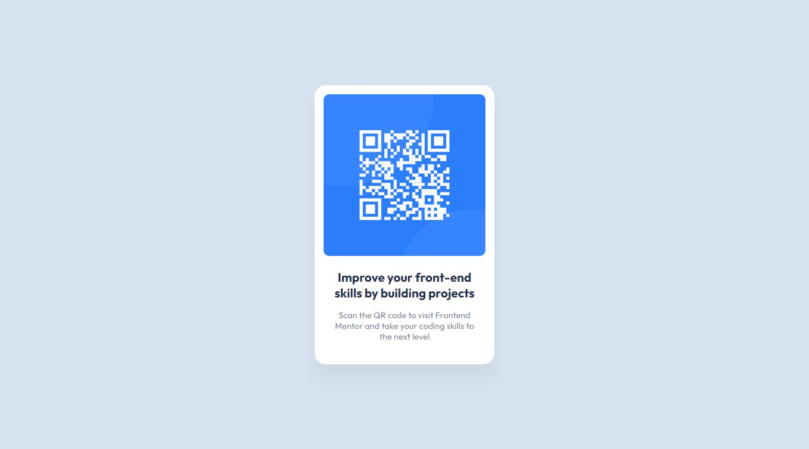

# Frontend Mentor - QR code component solution

This is a solution to the [QR code component challenge on Frontend Mentor](https://www.frontendmentor.io/challenges/qr-code-component-iux_sIO_H). Frontend Mentor challenges help you improve your coding skills by building realistic projects.

## Table of contents

- [Overview](#overview)
  - [Screenshot](#screenshot)
  - [Links](#links)
- [My process](#my-process)
  - [Built with](#built-with)
  - [What I learned](#what-i-learned)
  - [Continued development](#continued-development)
  - [Useful resources](#useful-resources)
- [Author](#author)

## Overview

### Screenshot

1. Size 1440×800



2. Size 375x667


### Links

- Solution URL: [Source Code](https://github.com/Deri-Kurniawan/frontendmentordotio-challenges/tree/development/1_qr-code-component/)
- Live Site URL: [deri-kurniawan.github.io/frontendmentordotio-challenges/1_qr-code-component/](https://deri-kurniawan.github.io/frontendmentordotio-challenges/1_qr-code-component/index.html)

## My process

### Built with

- Semantic HTML5 markup
- CSS custom properties
- CSS pseudo-class
- Flexbox
- Mobile-first workflow

### What I learned

I learned how to create cards with a semantic HTML structure, learned different ways to sort the writing of css properties and I also learned how to do class naming using the [BEM (Block Element Modifier)](https://en.bem.info/methodology/) methodology to keep the code clean and easy to read and maintain.

```html
<div class="wrapper">
  <div class="card">
    
    <div class="card__body">
      <h3 class="card__title">
        Improve your front-end skills by building projects
      </h3>
      <p class="card__description">
        Scan the QR code to visit Frontend Mentor and take your coding skills to
        the next level
      </p>
    </div>
  </div>
</div>
```

### Continued development

Previously I was still a bit difficult in choosing the right class name for each element, and that's the reason I was more comfortable in using TailwindCSS without having to bother thinking about the class name for an element. But I will learn and implement it while using the BEM (Block Element Modifier) methodology in the next development and also try to explore a more suitable class name for each element.

### Useful resources

- [BEM Methodology](https://en.bem.info/methodology/) - This helped me understand the BEM methodology and how to use it in my projects. I think it is a great methodology to keep the code clean and easy to read and maintain.
- [MDN Web Docs - CSS](https://developer.mozilla.org/en-US/docs/Web/CSS) - Clearly, this is the best place to learn about CSS. I always refer to this site when I forget about CSS properties or when I want to learn something new about CSS.
- [CSS Tricks - New Poll: How do you order your CSS properties?](https://css-tricks.com/new-poll-how-order-css-properties/) - This article provides a reference on how to sort the writing of CSS properties in various ways.

## Author

- Website - [Deri Kurniawan](https://deri.my.id/)
- Frontend Mentor - [@Deri-Kurniawan](https://www.frontendmentor.io/profile/Deri-Kurniawan)
