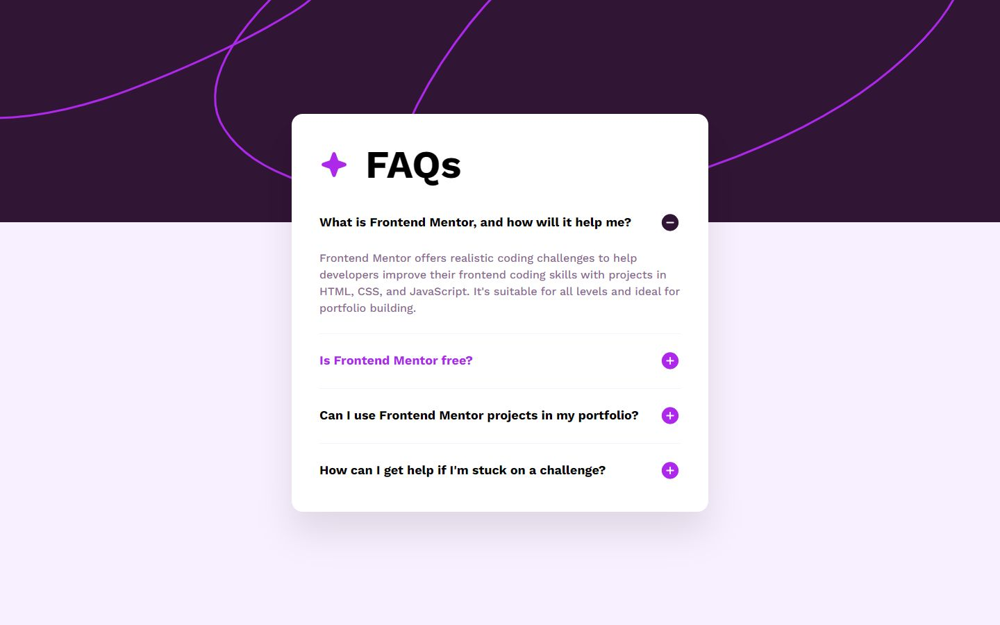

# Frontend Mentor - FAQ accordion solution

This is a solution to the [FAQ accordion challenge on Frontend Mentor](https://www.frontendmentor.io/challenges/faq-accordion-wyfFdeBwBz). Frontend Mentor challenges help you improve your coding skills by building realistic projects.

## Table of contents

- [Overview](#overview)
  - [The challenge](#the-challenge)
  - [Screenshot](#screenshot)
  - [Links](#links)
- [My process](#my-process)
  - [Built with](#built-with)
  - [What I learned](#what-i-learned)
  - [Continued development](#continued-development)
  - [Useful resources](#useful-resources)
- [Author](#author)
- [Acknowledgments](#acknowledgments)

## Overview

### The challenge

Users should be able to:

- Hide/Show the answer to a question when the question is clicked
- Navigate the questions and hide/show answers using keyboard navigation alone
- View the optimal layout for the interface depending on their device's screen size
- See hover and focus states for all interactive elements on the page

### Screenshot

1. Size 1440×900 - Normal


2. Size 375x812 - Normal


3. Size 1440×900 - Active State



4. Size 375x812 - Active State


### Links

- Solution URL: [Source Code](https://github.com/Deri-Kurniawan/frontendmentordotio-challenges/tree/development/2_faq-accordion/)
- Live Site URL: [deri-kurniawan.github.io/frontendmentordotio-challenges/2_faq-accordion/](https://deri-kurniawan.github.io/frontendmentordotio-challenges/2_faq-accordion/index.html)

## My process

### Built with

- Semantic HTML5 markup
- CSS custom properties
- CSS pseudo-class
- Javascript (DOM & Events)
- Flexbox
- Mobile-first workflow

### What I learned

I learned to implement the [BEM (Block Element Modifier)](https://en.bem.info/methodology/) methodology. I learned how to create an accordion using HTML, CSS, and JavaScript. I discovered how to use the `aria-expanded` attribute to indicate whether the accordion content is visible or hidden, and the `aria-controls` attribute to link control buttons with their content. In addition, I learned to manipulate the DOM to toggle the visibility of accordion content when a control button is clicked or the Enter or arrow keys are pressed. I also formed JavaScript event listeners to make the accordions reusable and ensure that the events for each accordion are independent.

This is the HTML structure for the accordion:

```html
<div class="accordion">
  <div class="accordion__item" aria-expanded="true">
    <h3 class="accordion__title" aria-controls="accordion" tabindex="0">
      What is Frontend Mentor, and how will it help me?
      
    </h3>
    <p class="accordion__description">
      Frontend Mentor offers realistic coding challenges to help developers
      improve their frontend coding skills with projects in HTML, CSS, and
      JavaScript. It's suitable for all levels and ideal for portfolio building.
    </p>
  </div>
</div>
```

Here is the JavaScript code to toggle the visibility of the accordion content:

```js
const accordions = document.querySelectorAll(".accordion");

accordions.forEach((accordion) => {
  const accordionToggles = accordion.querySelectorAll(
    "[aria-controls='accordion']"
  );

  accordionToggles.forEach((accordionToggle) => {
    const handleAccordionActive = () => {
      const plusIconSrc = "./assets/images/icon-plus.svg";
      const minusIconSrc = "./assets/images/icon-minus.svg";

      accordionToggles.forEach((item) => {
        if (item !== accordionToggle) {
          item.parentElement.setAttribute("aria-expanded", "false");
          item.querySelector("img").src = plusIconSrc;
        }
      });

      const isExpanded =
        accordionToggle.parentElement.getAttribute("aria-expanded") === "true"
          ? "false"
          : "true";

      accordionToggle.parentElement.setAttribute("aria-expanded", isExpanded);
      accordionToggle.querySelector("img").src =
        accordionToggle.parentElement.hasAttribute("aria-expanded") &&
        isExpanded === "true"
          ? minusIconSrc
          : plusIconSrc;
    };

    accordionToggle.addEventListener("click", handleAccordionActive);
    accordionToggle.addEventListener("keydown", (e) => {
      if (e.key === "Enter") {
        handleAccordionActive();
      }
    });
  });
});
```

And this events listener to navigate the questions and hide/show answers using keyboard navigation alone:

```js
const handleArrowKey = (e) => {
  if (e.key === "Escape") {
    document.activeElement.blur();
  }

  if (e.key === "ArrowDown" || e.key === "ArrowUp") {
    const accordionTitles = document.querySelectorAll(
      "[aria-controls='accordion']"
    );
    const activeTitle = document.querySelector(
      "[aria-controls='accordion']:focus"
    );
    const activeTitleIndex = Array.from(accordionTitles).indexOf(activeTitle);

    if (e.key === "ArrowDown") {
      if (activeTitleIndex < accordionTitles.length - 1) {
        accordionTitles[activeTitleIndex + 1].focus();
        accordionTitles[activeTitleIndex + 1].click();
      } else {
        accordionTitles[0].focus();
        accordionTitles[0].click();
      }
    } else {
      if (activeTitleIndex > 0) {
        accordionTitles[activeTitleIndex - 1].focus();
        accordionTitles[activeTitleIndex - 1].click();
      } else {
        accordionTitles[accordionTitles.length - 1].focus();
        accordionTitles[accordionTitles.length - 1].click();
      }
    }
  }
};

document.addEventListener("keydown", handleArrowKey);
```

So, if accordion is more than one, the events for each accordion are independent.

```html
<div class="accordion">
  <div class="accordion__item" aria-expanded="true">
    <!-- ... -->
  </div>
  <div class="accordion__item" aria-expanded="true">
    <!-- ... -->
  </div>
</div>

<div class="accordion">
  <div class="accordion__item" aria-expanded="true">
    <div class="accordion__item" aria-expanded="true">
      <!-- ... -->
    </div>
    <div class="accordion__item" aria-expanded="true">
      <!-- ... -->
    </div>
  </div>
</div>
```

### Continued development

I will continue to improve my JavaScript skills by learning more about the DOM and events. I will also practice creating more interactive components to enhance my frontend development skills. I will also learn more about accessibility.

### Useful resources

- [BEM Methodology](https://en.bem.info/methodology/) - This helped me understand the BEM methodology and how to use it in my projects. I think it is a great methodology to keep the code clean and easy to read and maintain.
- [MDN Web Docs - CSS](https://developer.mozilla.org/en-US/docs/Web/CSS) - Clearly, this is the best place to learn about CSS. I always refer to this site when I forget about CSS properties or when I want to learn something new about CSS.
- [MDN Web DOcs - Javascript](https://developer.mozilla.org/en-US/docs/Web/JavaScript) - This is the best place to learn about JavaScript.

## Author

- Website - [Deri Kurniawan](https://deri.my.id/)
- Frontend Mentor - [@Deri-Kurniawan](https://www.frontendmentor.io/profile/Deri-Kurniawan)
